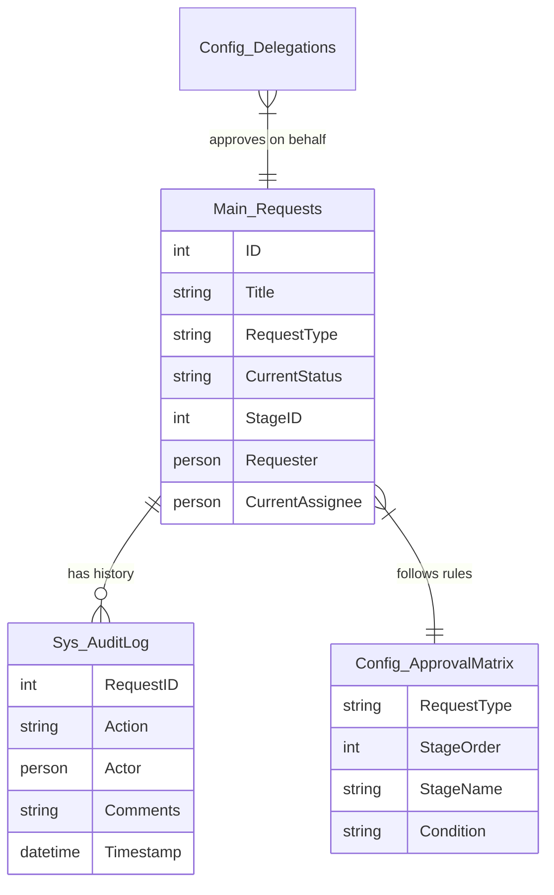
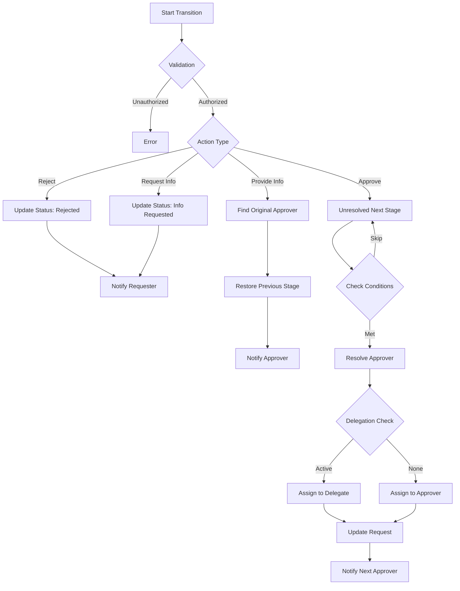
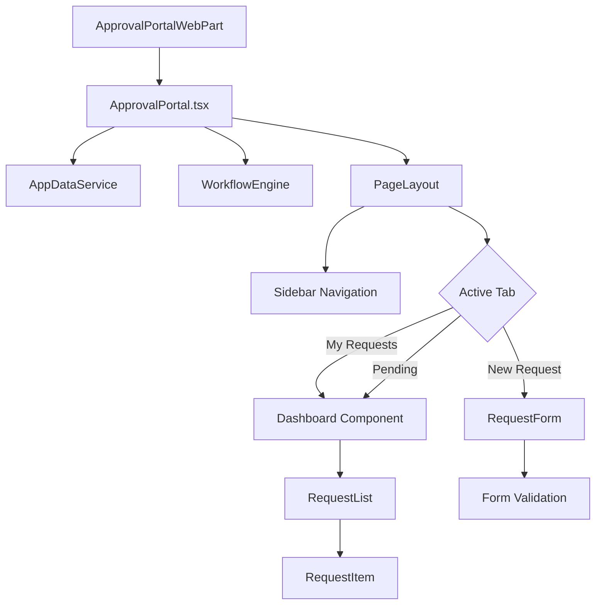
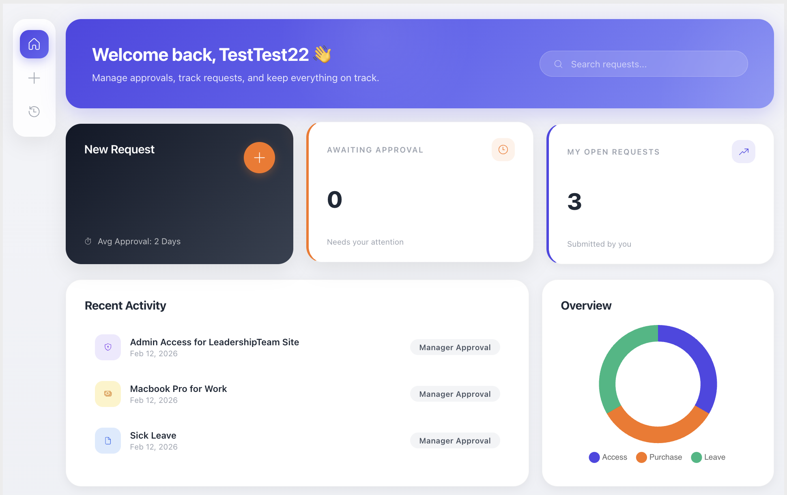
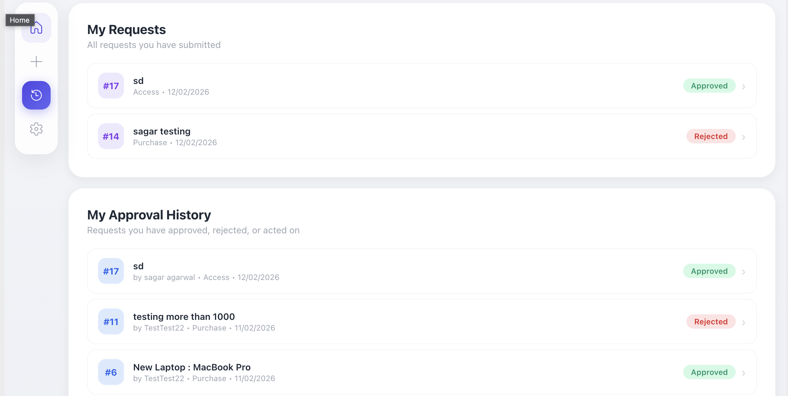

# Approval Portal

A robust SharePoint Framework (SPFx) application designed to streamline business approval workflows. This solution features a dynamic rule-based engine, customizable approval matrices, and comprehensive audit trails.

## 🚀 Features

-   **Dynamic Workflow Engine**: Automated transition of requests between stages based on configurable logic.
-   **Configurable Approval Matrix**: Define approval flows (Linear, Conditional, Dynamic Managers) without code changes via SharePoint Lists.
-   **Role-Based Access**: Specialized views for Requesters, Approvers, and Admins.
-   **Delegate Management**: Handle Out-of-Office scenarios with automatic task delegation.
-   **Audit Logging**: Detailed, immutable history of all actions, comments, and state changes.
-   **Email Notifications**: Automated alerts for approvals, rejections, information requests, and delegation.

## 🛠 Tech Stack

-   **Framework**: SharePoint Framework (SPFx) 1.22.2
-   **Frontend**: React 17, Fluent UI
-   **Data Interaction**: PnPjs v4
-   **Build Tools**: Gulp, Webpack, Heft

## 📦 Installation & Setup

### Prerequisites
-   Node.js v18+ (Recommended: v20 LTS or v22 LTS)
-   Gulp-cli
-   Yeoman & SharePoint Generator

### Local Development

1.  **Clone the repository**
    ```bash
    git clone https://github.com/sagar1503/ApprovalPortal.git
    cd ApprovalPortal/approval-portal
    ```

2.  **Install Dependencies**
    ```bash
    npm install
    ```

3.  **Run the Solution**
    ```bash
    gulp serve
    ```
    Access the local workbench at:
    `https://{tenant}.sharepoint.com/_layouts/15/workbench.aspx`

## ⚙️ Configuration

The application relies on the following SharePoint Lists. Ensure these are created in your site:

### 1. Main_Requests
Primary storage for all approval requests.
-   **Columns**: RequestType (Text), CurrentStatus (Text), StageID (Number), Requester (Person), CurrentAssignee (Person), JSON_Payload (Note).

### 2. Config_ApprovalMatrix
Defines the workflow steps and logic.
-   **Columns**: 
    -   RequestType (Text)
    -   StageOrder (Number)
    -   StageName (Text)
    -   ApproverType (Choice: 'Dynamic-Manager', 'Static-User', 'Static-Group')
    -   ApproverValueId (Number/Person)
    -   Condition (Note) - *JSON Logic e.g., `{"Amount": ">1000"}`*

### 3. Config_Delegations
Manages temporary approval reassignment.
-   **Columns**: Approver (Person), Delegate (Person), StartDate (Date), EndDate (Date).

### 4. Sys_AuditLog
Immutable log of all workflow actions.
-   **Columns**: RequestID (Lookup), Action (Text), Actor (Person), Comments (Note), Snapshot (Note), Timestamp (Date).




## 🔮 Future Roadmap

-   **Microsoft Teams Integration**: Native Teams app with Adaptive Cards for seamless approvals directly in chat.
-   **Analytics Dashboard**: Power BI integration to track metrics like "Average Time to Approve" and identify bottlenecks.
-   **AI-Powered Insights**: Smart grouping of similar requests and anomaly detection for fraud prevention.
-   **Mobile Experience**: Dedicated, responsive PWA design for optimized on-the-go approvals.
-   **Document Attachments**: Support for file uploads (PDFs, Images) within requests.
-   **Multi-Language Support**: Localization to support global deployment.

## 🏗 Architecture

### Workflow Engine (`WorkflowEngine.ts`)
The core processing logic acting as a state machine. It handles:
-   **State Transitions**: Moving requests from Stage N to N+1.
-   **Validation**: Ensuring the current actor is authorized.
-   **Condition Evaluation**: determining if a stage should be skipped based on request data.
-   **Notification Dispatching**: Sending emails via `sp.utility.sendEmail`.



### Data Service (`AppDataService.ts`)
Centralized layer for all SharePoint interactions using PnPjs.
-   Abstracts REST calls for Items, Profiles, and Emails.
-   Implements retry logic and error handling.

### Component Architecture



## 📸 UI Gallery

> *Note: Placeholders for project screenshots.*

### Dashboard View

*Central hub for managing approvals and tracking request status.*

### Request Submission Form

*Dynamic form for submitting new approval requests.*

### Request Details

*Detailed view of an approved request.*

### History View

*Comprehensive list of all requests submitted and approvals made.*

### Admin Dashboard

*Exclusive view for administrators to manage matrix configurations and system settings.*

## 📝 License
[MIT](LICENSE)